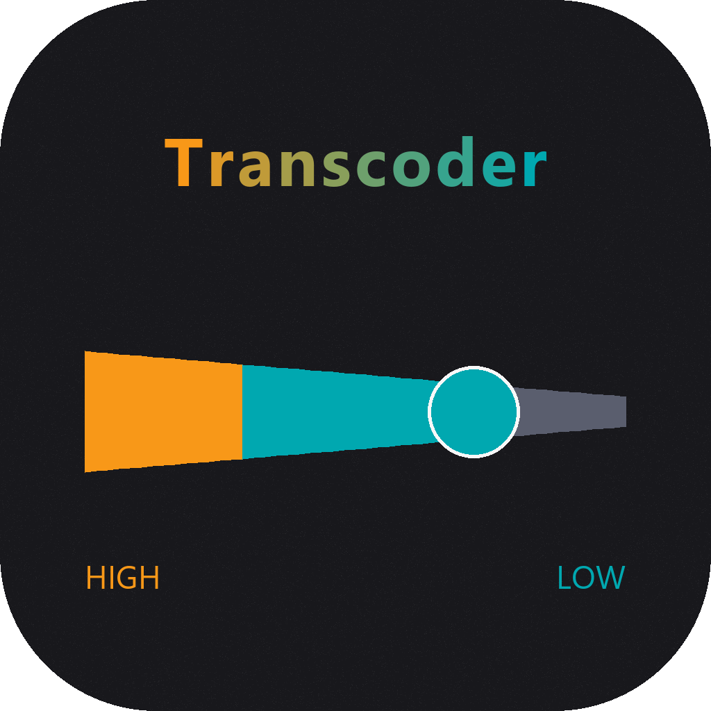
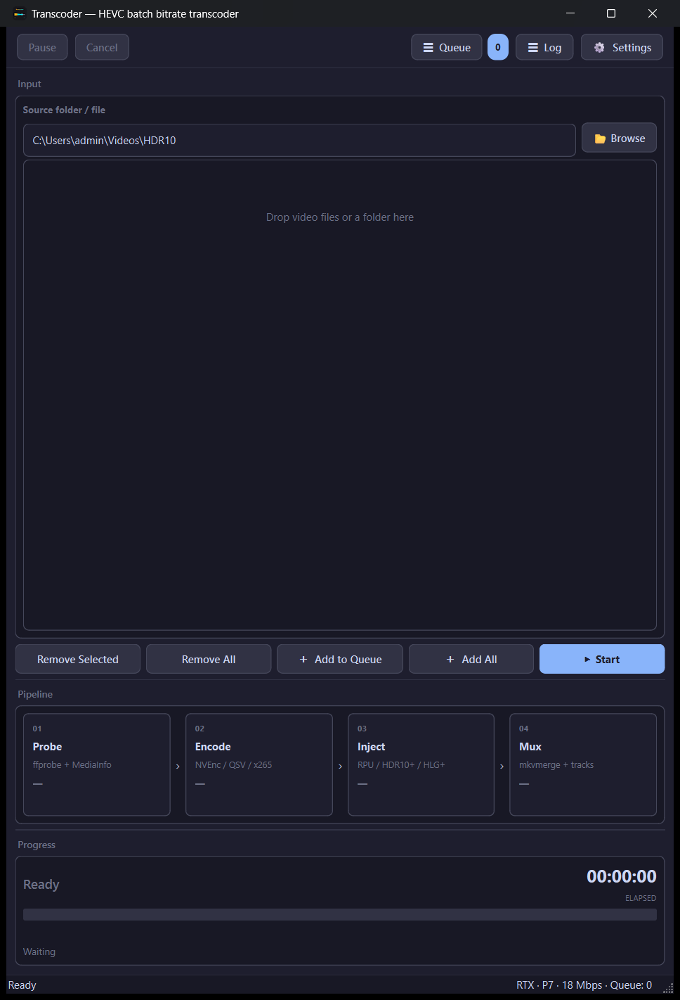
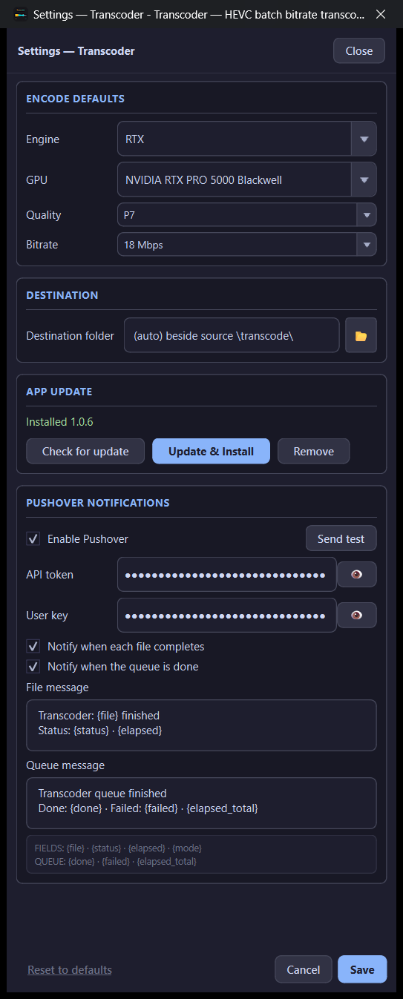

# Transcoder

  

  
  
  
  

---

## What is Transcoder? (plain English)

**Transcoder re-encodes videos to HEVC (H.265) at a bitrate you choose** — smaller files, same resolution family, without you fighting ffmpeg by hand.

Drop a folder of MKVs, pick an engine (default **RTX** on NVIDIA), a quality preset (default **P7**), and a target bitrate (default **18 Mbps**). Click **Start**. Finished files land in a `\transcode\` folder next to your source.

If the source has fancy HDR metadata (Dolby Vision RPU, HDR10+, HLG+), the app tries to **inject it back** after encode so the new file keeps that dynamic HDR info.

### What happens to each file

| Step | In plain words |
|------|----------------|
| **1 · Probe** | Read the file with ffprobe + MediaInfo (size, bitrate, HDR type). |
| **2 · Encode** | Compress to HEVC — **NVEnc** (RTX), **QSV** (Intel), or **x265** (CPU). |
| **3 · Inject** | Put RPU / HDR10+ / HLG+ metadata back when the source had it. |
| **4 · Mux** | Rebuild the MKV with video + original audio/subtitle tracks (`mkvmerge`). |

### Engines (quick guide)

| Engine | Notes |
|--------|--------|
| **RTX** (default) | NVIDIA NVEnc — fast; presets **P1–P7** (P7 = best quality) |
| **Intel GPU** | QSV path — levels L7→L1 |
| **CPU / CPU (CUDA)** | x265 software — slower, preset UltraFast→Placebo |

Bitrate presets include 72 / 25 / 18 / 8 Mbps or custom.

---

## Screenshots

  

<em>Main window — drop files, Probe → Encode → Inject → Mux.</em>

  

<em>Settings — engine / GPU / quality / bitrate, destination, App update, Pushover.</em>

---

## How to use (quick start)

1. Install from [Releases](https://github.com/aberthil/Transcoder-releases/releases/latest) and open **Transcoder**.  
2. **Browse** or **drag-and-drop** videos / a folder.  
3. Optional: **Settings** → engine (RTX / Intel / CPU), preset, bitrate, destination.  
4. **+ Add to Queue** (or **Add All**) → **Start**.  
5. When it finishes, open the `\transcode\` folder beside your source.

**Queue / Log / Settings** sit top-right. Pause and Cancel work while a job runs. Optional Pushover alerts when each file or the whole queue completes.

---

## Download

| | |
|--|--|
| **Latest Setup** | [Transcoder-1.0.6-Setup.exe](https://github.com/aberthil/Transcoder-releases/releases/latest/download/Transcoder-1.0.6-Setup.exe) |
| **All versions** | [Releases](https://github.com/aberthil/Transcoder-releases/releases) |
| **SHA-256** | [Transcoder-1.0.6-Setup.exe.sha256](https://github.com/aberthil/Transcoder-releases/releases/latest/download/Transcoder-1.0.6-Setup.exe.sha256) |

> Prefer the **latest** tag always:  
> https://github.com/aberthil/Transcoder-releases/releases/latest

Installs to `C:\DolbyVisionScripts\Transcoder` by default. Settings / Pushover / queue live in AppData (`Transcoder-userdata`) and **survive App Update**. Only a full **Remove** wipes them.

---

## Requirements

| | |
|--|--|
| OS | Windows 10/11 **x64** |
| GPU | **NVIDIA** recommended for RTX path; Intel QSV or CPU also work |
| Disk | Output size depends on bitrate × duration — plan accordingly |

Encode tools ship inside Setup (no scavenger hunt for NVEncC / mkvmerge / etc.).

---

## Install

1. Download **Transcoder-*-Setup.exe** from [Releases](https://github.com/aberthil/Transcoder-releases/releases/latest)  
2. Run Setup (admin)  
3. Launch **Transcoder** from the Finish page / Start Menu  

**Update the app:** Settings → App update → Check → Update & Install  
(keeps AppData userdata)

---

## What's New

### v1.0.6

See [Releases](https://github.com/aberthil/Transcoder-releases/releases) for notes on each Setup build.

---

## Links

- **Latest download:** https://github.com/aberthil/Transcoder-releases/releases/latest  
- **This repo:** public Setup hosting + project page (source stays private)

---

## License / support

Windows installers for end users. Problems with a specific Setup: note the release tag and contact the publisher (`aberthil`).
